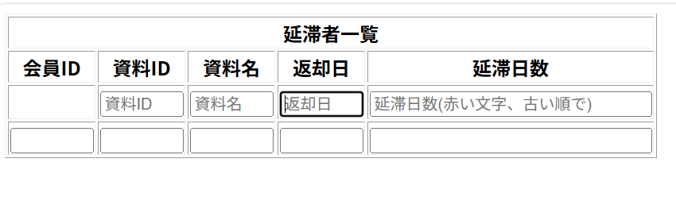

# レイアウト設計書

| システム名 | ユースケース名 | グループ名 | 承認印 | 作成日 | ver. | 担当者 |
|:-----:|:-------:|:-----:|:---:|:---:|:----:|:---:|
| 図書館サイト | メイン画面・延滞画面 | やろう |  | 2026/06/12 | 1\.00 | 若松大晟 |

| 画面ID | 名称 |
|:----:|:--:|
| UI003 | メイン画面・延滞画面 |

## メイン画面・延滞画面(top.jsp)

### 入力イラスト/入力方法

### 入出力機能

| \# | 入出力項目 | I/O | パラメータ | 備考 |
|:-:|:-----:|:---:|:-----:|:---|
| 1 | 会員番号 | O |  | member_id |
| 2 | 資料ID | O |  | book_id |
| 3 |　資料名 | O |  | title |
| 4 | 返却日   | O |  | return_date |
| 5 | 延滞日数 | O |  | late_date |

### イベント

| \# | イベント | servlet | POST/GET | action | パラメータ |
|:-:|:----:|:-------:|:--------:|:------:|:------|

