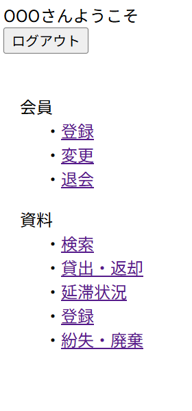

# レイアウト設計書

| システム名 | ユースケース名 | グループ名 | 承認印 | 作成日 | ver. | 担当者 |
|:-----:|:-------:|:-----:|:---:|:---:|:----:|:---:|
| 図書館サイト | メニュー画面 | やろうグループ |  | 2026/06/12 | 1\.00 | 高 |

| 画面ID | 名称 |
|:----:|:--:|
| UI002 | メニュー画面 |

## 商品一覧画面(menu.jsp)

### 入力イラスト/入力方法な

### 入出力機能

| \# | 入出力項目 | I/O | パラメータ | 備考 |
|:-:|:-----:|:---:|:-----:|:---|
| 1 | 社員名 | O | staff.name |  |

### イベント

| \# | イベント | servlet | POST/GET | action | パラメータ |
|:-:|:----:|:-------:|:--------:|:------:|:------|
| 1 | ログアウト | MenuServlet | POST | logout |  |
| 2 | 新規会員登録 | MenuServlet | POST | member_regist |  |
| 3 | 会員情報変更 | MenuServlet | POST | update |  |
| 4 | 会員退会 | MenuServlet | POST | cancel |  |
| 5 | 資料検索 | MenuServlet | POST | search |  |
| 6 | 資料貸出・返却 | MenuServlet | POST | rr |  |
| 7 | 新規資料登録 | MenuServlet | POST | book_regist |  |
| 8 | 紛失・廃棄 | MenuServlet | POST | discard |  |
| 9 | 延滞状況 | MenuServlet | POST | delay |  |