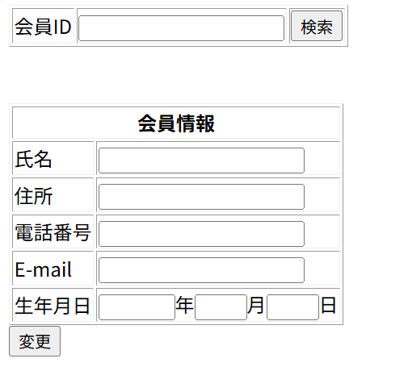

# レイアウト設計書

| システム名 | ユースケース名 | グループ名 | 承認印 | 作成日 | ver. | 担当者 |
|:-----:|:-------:|:-----:|:---:|:---:|:----:|:---:|
| 図書館サイト | 会員登録変更 | やろう |  | 2020/06/12 | 1\.00 | 平 |

| 画面ID | 名称 |
|:----:|:--:|
| UI103 | 会員登録変更 |

## 商品一覧画面(memberUpdate.jsp)

### 入力イラスト/入力方法な

### 入出力機能

| \# | 入出力項目 | I/O | パラメータ | 備考 |
|:-:|:-----:|:---:|:-----:|:---|
| 1 | 会員ID | I | \- | 会員IDを入力する |
| 2 | 氏名 | O/I |  |  |
| 3 | 住所 | O/I |  |  |
| 4 | 電話番号 | O/I |  |  |
| 5 | E-Mail | O/I |  |  |
| 6 | 生年月日 | O/I |  |  |

### イベント

| \# | イベント | servlet | POST/GET | action | パラメータ |
|:-:|:----:|:-------:|:--------:|:------:|:------|
| 1 | 登録変更ボタン | MemberServlet | POST | change | id |
