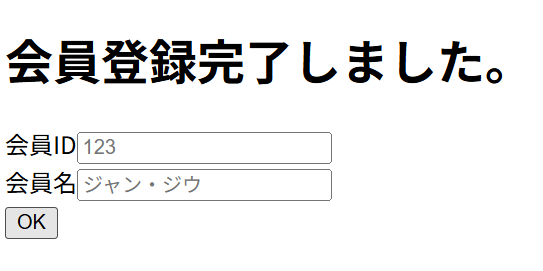

# レイアウト設計書

| システム名 | ユースケース名 | グループ名 | 承認印 | 作成日 | ver. | 担当者 |
|:-----:|:-------:|:-----:|:---:|:---:|:----:|:---:|
| 図書館サイト | 会員登録完了画面 | やろう |  | 2026/06/15 | 1\.00 | 高 |

| 画面ID | 名称 |
|:----:|:--:|
| UI102 | 会員登録完了画面 |

## 会員登録完了画面(registResult.jsp)

### 入力イラスト/入力方法な

### 入出力機能

| \# | 入出力項目 | I/O | パラメータ | 備考 |
|:-:|:-----:|:---:|:-----:|:---|
| 1 | 会員ID | O | member_id |  |
| 2 | 会員名 | O | member_name |  |

### イベント

| \# | イベント | servlet | POST/GET | action | パラメータ |
|:-:|:----:|:-------:|:--------:|:------:|:------|
| 1 | OK | MemberServlet | POST | back |  |
