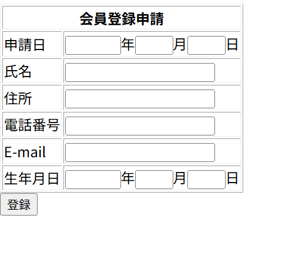

# レイアウト設計書

| システム名 | ユースケース名 | グループ名 | 承認印 | 作成日 | ver. | 担当者 |
|:-----:|:-------:|:-----:|:---:|:---:|:----:|:---:|
| 図書館サイト | 会員登録画面 | やろう |  | 2026/06/12 | 1\.00 | 高 |

| 画面ID | 名称 |
|:----:|:--:|
| UI002 | 会員登録画面 |

## 商品一覧画面(memberRegist.jsp)

### 入力イラスト/入力方法な

### 入出力機能

| \# | 入出力項目 | I/O | パラメータ | 備考 |
|:-:|:-----:|:---:|:-----:|:---|
| 1 | 申請日 | I |  | なし |
| 2 | 氏名　| I |  | name |
| 3 | 住所 | I |  | address |
| 4 | 電話番号 | I |  | tel |
| 5 | E-Mail | I |  | mail |
| 6 | 生年月日 | I |  | birth |

### イベント

| \# | イベント | servlet | POST/GET | action | パラメータ |
|:-:|:----:|:-------:|:--------:|:------:|:------|
| 1 | 登録 | MemberServlet | POST | regist | name/address/tel/mail/birth |
