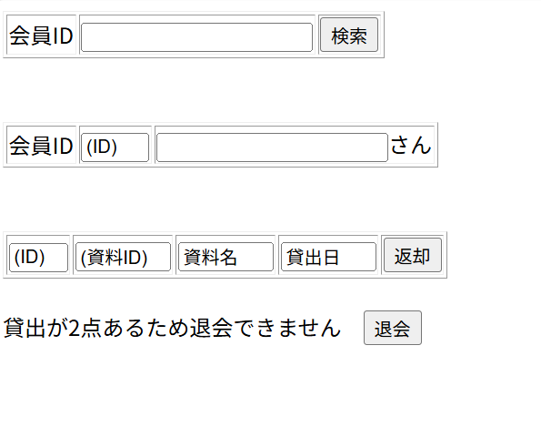

# レイアウト設計書

| システム名 | ユースケース名 | グループ名 | 承認印 | 作成日 | ver. | 担当者 |
|:-----:|:-------:|:-----:|:---:|:---:|:----:|:---:|
| 図書館サイト | 会員退会 | やろう |  | 2026/06/12 | 1\.00 | 若松大晟 |

| 画面ID | 名称 |
|:----:|:--:|
| UI104 | 会員退会 |

## 会員退会画面(memberCancel.jsp)

### 入力イラスト/入力方法な

### 入出力機能

| \# | 入出力項目 | I/O | パラメータ | 備考 |
|:-:|:-----:|:---:|:-----:|:---|
| 1 | 会員ID | I/O |  |  |
| 2 | 資料ID | O |  |  |
| 3 | 資料名 | O |  |  |
| 4 | 貸出日 | O | |  |

### イベント

| \# | イベント | servlet | POST/GET | action | パラメータ |
|:-:|:----:|:-------:|:--------:|:------:|:------|
| 1 | 返却ボタン | MemberServlet | POST | return | 資料ID(code) |
| 2 | 退会ボタン | MemberServlet | POST | delet | 会員ID(code) |
