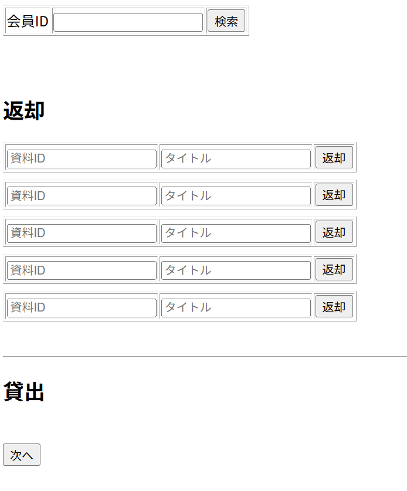

# レイアウト設計書

| システム名 | ユースケース名 | グループ名 | 承認印 | 作成日 | ver. | 担当者 |　画面ID | 名称 |
|:-----:|:-------:|:-----:|:---:|:---:|:----:|:---:|:----:|:--:|
| 図書館サイト | 貸出・返却 | やろう |  | 2020/06/12 | 1\.00 | ナム |UI202 | 貸出・返却画面 |

## 貸出・返却(bookRr.jsp)

### 入力イラスト/入力方法など

   

入力必

### 入出力機能

| \# | 入出力項目 | I/O | パラメータ | 備考 |
|:-:|:-----:|:---:|:-----:|:---|
| 1 | 会員ID | I | memberid | 会員を特定するための部分 |
| 2 | 資料ID | O | book_id | 返却年月日が記録されている行・繰り返し |
| 3 | 資料名 | O | title | 上記に同じ |
| 4 | 資料ID | I | bookid | 貸出の資料ID |

### イベント

| \# | イベント | servlet | POST/GET | action | パラメータ |
|:-:|:----:|:-------:|:--------:|:------:|:------|
| 1 | 資料返却 | LibraryServlet | POST | return | memberid / bookid |
| 2 | 資料貸出確認画面 | LibraryServlet | POST | borrow_check | memberid / bookid |
