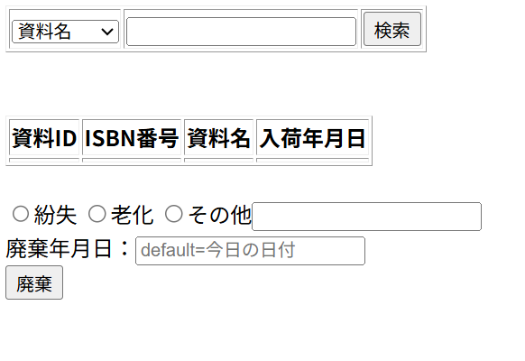

# レイアウト設計書

| システム名 | ユースケース名 | グループ名 | 承認印 | 作成日 | ver. | 担当者 |
|:-----:|:-------:|:-----:|:---:|:---:|:----:|:---:|
| 新宿図書館サイト | 資料廃棄 | やろう！ |  | 2026/06/12 | 1\.00 | ジャン・ジウ |

| 画面ID | 名称 |
|:----:|:--:|
| UI205 | 資料廃棄 |

## 資料廃棄画面(bookDiscard.jsp)

### 入力イラスト/入力方法な

### 入出力機能

| \# | 入出力項目 | I/O | パラメータ | 備考 |
|:-:|:-----:|:---:|:-----:|:---|
| 1 | 資料名 | I | title |  |
| 2 | 資料ID | I | bookid |  |
| 3 | ISBN番号 | I | bookisbn |  |
|  |  |  |  |  |
| 4 | 資料ID | O | book_id |  |
| 5 | ISBN番号 | O | isbn |  |
| 6 | 資料名	 | O | title |  |
| 7 | 入荷年月日 | O | arrival_date |  |
|  |  |  |  |  |
| 8 | 紛失 | I | lost |  |
| 9 | 老化 | I | old |  |
| 10 | その他 | I | etc | 職員が入力した内容 |
| 11 | 廃棄年月日 | I | なし(curren_date) | 今日の日付けが自動的に入力 |

### イベント

| \# | イベント | servlet | POST/GET | action | パラメータ |
|:-:|:----:|:-------:|:--------:|:------:|:------|
| 1 | 検索ボタン | LibraryServlet | POST | search | title/ bookid/ bookisbn|
| 2 | 廃棄ボタン | LibraryServlet | POST | discard |lost/ old/ etc/  |

