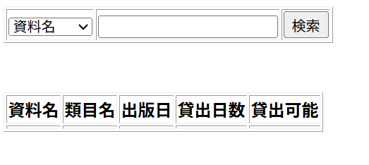

# レイアウト設計書

| システム名 | ユースケース名 | グループ名 | 承認印 | 作成日 | ver. | 担当者 |
|:-----:|:-------:|:-----:|:---:|:---:|:----:|:---:|
| 新宿図書館サイト | 資料検索 | やろう！|  | 2026/06/12 | 1\.00 | ジャン・ジウ |

| 画面ID | 名称 |
|:----:|:--:|
| UI201 | 資料検索|

## 資料検索(bookSearch.jsp)

### 入力イラスト/入力方法な

### 入出力機能

| \# | 入出力項目 | I/O | パラメータ | 備考 |
|:-:|:-----:|:---:|:-----:|:---|
| 1 | 資料名 | I | 　 |  |
| 2 | 資料ID | I |  |  |
| 3 | ISBN番号 | I |  |  |
|   |        |   |   |   |
| 4 | 資料名 | O |  |  |
| 5 | 類目名 | O | \- |  |
| 6 | 出版日 | O | \- |  |
| 7 | 貸出日数 | O | \- | |
| 8 | 貸出可能 | O | \- |  貸出していない資料の資料IDのみ表示|
### イベント

| \# | イベント | servlet | POST/GET | action | パラメータ |
|:-:|:----:|:-------:|:--------:|:------:|:------|
| 1 | 検索ボタン | LibraryServlet | POST | search |資料名 資料ID ISBN番号|
