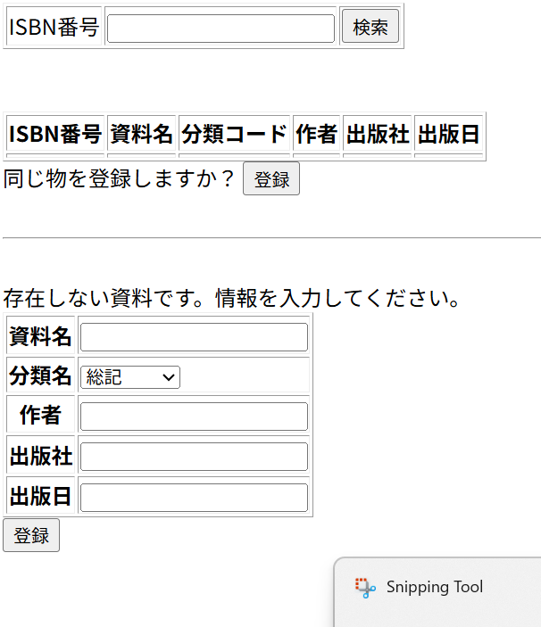

# レイアウト設計書

| システム名 | ユースケース名 | グループ名 | 承認印 | 作成日 | ver. | 担当者 |
|:-----:|:-------:|:-----:|:---:|:---:|:----:|:---:|
| 図書館サイト | 資料登録 | やろう |  | 2020/06/12 | 1\.00 | 平 |

| 画面ID | 名称 |
|:----:|:--:|
| UI102 | 資料登録 |

## 商品一覧画面(list.jsp)

### 入力イラスト/入力方法な

### 入出力機能

| \# | 入出力項目 | I/O | パラメータ | 備考 |
|:-:|:-----:|:---:|:-----:|:---|
| 1.1 | ISBN検索 | I | \- |  |
| 1.2 | ISBN | O |  |  |
| 1.3 | 資料名 | O |  |  |
| 1.4 | 分類コード | O |  |  |
| 1.5 | 著者 | O |  |  |
| 1.6 | 出版社 | O |  |  |
| 1.7 | 出版日 | O |  |  |
|  |  |  |  |  |
| 2.1 | 資料名 | I |  |  |
| 2.2 | 分類名 | I |  |  |
| 2.3 | 著者 | I |  |  | 
| 2.4 | 出版社 | I |  |  |
| 2.5 | 出版日 | I |  |  | 

### イベント

| \# | イベント | servlet | POST/GET | action | パラメータ |
|:-:|:----:|:-------:|:--------:|:------:|:------|
| 1 | 登録ボタン | BookServlet | POST | regist | ISBN（number） 資料名（book） 分類コード(code) 著者（name） 出版社 出版日 |
